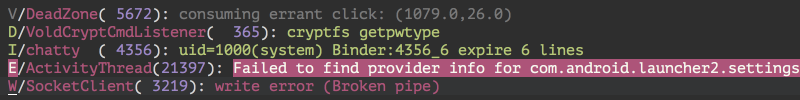
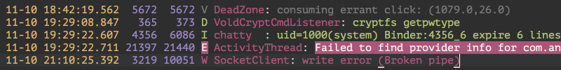
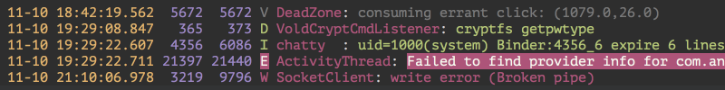
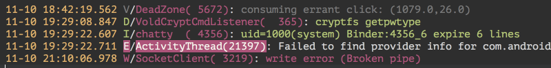
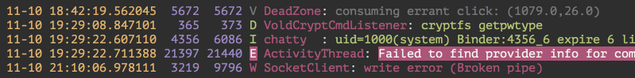
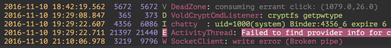

# sublime-logcat

Display colorized log captured by `adb logcat` in Sublime Text.

## Installation

Choose either one of the following:

- [Package Control](https://packagecontrol.io/packages/Logcat)
- [Download](https://github.com/yinghau76/sublime-logcat/archive/master.zip) this repo, rename it to 'Logcat', and place it within your `Packages` folder. This can be found within Sublime Text at `Preferences > Browse Packages…`
- Clone the repo into your `Packages` folder ` git clone git://github.com/yinghau76/sublime-logcat Logcat`

## Usage

1. <kbd>Ctrl</kbd>+<kbd>Shift</kbd>+<kbd>P</kbd>
1. `detect logcat`
1. You should see a colorized log. Enjoy!

## Formats

Currently only the following formats are supported:

### brief 

### printable 

### threadtime 

### time 

### usec 

### year 

## Attribution

Logcat language definitions are from https://github.com/leesei/logcat.tmLanguage.
